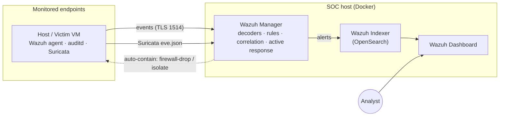

# 🛡️ Home SOC — a complete Security Operations Centre in a box


A small but **complete, defensible SOC** you can stand up on a single 8 GB
laptop: log collection, a network IDS, a SIEM/XDR that correlates and alerts,
custom detection rules mapped to **MITRE ATT&CK**, incident-response playbooks,
safe attack simulations, and full **analyst investigation write-ups**.

It's built to mirror what a real SOC analyst actually does — detect brute force,
malware, privilege escalation, web attacks and C2 — and to be **reproducible**:
one command brings the whole stack up.

> **Author:** Anthony Mackenzi · **Focus:** Blue Team / Defensive Security

---

## Architecture



Full write-up: [`docs/01-architecture.md`](docs/01-architecture.md).

## What's inside

- **SIEM/XDR** — Wazuh single-node (manager + indexer + dashboard), tuned for 8 GB.
- **Log pipeline** — SSH/auth, `auditd` (keyed), real-time File Integrity
  Monitoring, and Suricata network alerts, all correlated in one place.
- **Detection engineering** — 14 custom Wazuh rules + 6 Suricata signatures, every
  one tagged with a MITRE ATT&CK technique, plus **portable Sigma** twins.
- **Incident response** — 5 playbooks on the SANS/NIST lifecycle, with automated
  active-response examples.
- **Attack simulations** — safe, reversible scripts that trigger every detection.
- **Investigations** — 3 full analyst reports (triage → evidence → verdict → tuning).
- **Reproducible & CI-checked** — Docker Compose, a `Makefile`, and a GitHub
  Actions workflow that lints shell + validates every rule.

## MITRE ATT&CK coverage

Detections span **8 tactics** — Reconnaissance, Initial Access, Execution,
Persistence, Privilege Escalation, Credential Access, Discovery, and Command &
Control. The full matrix — **and an honest list of the gaps** (Defense Evasion,
Lateral Movement, Exfiltration) with a plan to close them — is in
[`docs/09-mitre-attack-coverage.md`](docs/09-mitre-attack-coverage.md).

## Quick start

```bash
# Prereqs: Docker Engine + Compose plugin (see docs/02-setup.md)
git clone <your-home-soc-repo-url> && cd home-soc

make up        # certs + start + load detection rules (one command)
# -> dashboard at https://localhost/  (admin / SecretPassword — change it!)

# Fire your first detection (self-contained, no target needed):
bash simulations/custom-app-bruteforce/run.sh
# then on the dashboard: Threat Hunting -> Events -> rule.id:100072
```

Full setup (Docker install, enrolling endpoints, Suricata):
[`docs/02-setup.md`](docs/02-setup.md). Everyday commands: `make help`.

## Repository structure

```
home-soc/
├── deploy/          Wazuh single-node stack (compose, configs, Suricata, auditd)
├── scripts/         bootstrap, rule deployment, health, endpoint installers
├── detections/      Wazuh rules + custom decoder, Sigma rules, detection catalogue
├── playbooks/       incident-response playbooks (SANS/NIST lifecycle)
├── simulations/     safe scripts that trigger each detection
├── investigations/  full analyst write-ups
├── docs/            architecture, setup, detection engineering, IR, hardening
└── Makefile         make up / down / health / deploy-rules / logtest
```

## Detections at a glance

| Example detection | MITRE | Source |
|-------------------|-------|--------|
| Successful login **after** brute force | T1110 | auth + correlation |
| Sudoers modified | T1548.003 | auditd |
| Web shell written to web root | T1505.003 | real-time FIM |
| Reverse shell (payload + netcat + egress) | T1059 / T1095 | auditd + FIM + Suricata |
| SQL injection in URI | T1190 | web log + Suricata |

Full catalogue with simulations and playbooks:
[`detections/README.md`](detections/README.md).

## Investigations — the part most home labs skip

Anyone can screenshot a dashboard. These are the artifacts that show I can
actually *work an incident*:

- [INV-01 — SSH brute force → account compromise](investigations/2026-07-01-ssh-brute-force/report.md)
- [INV-02 — Web attack → web shell upload](investigations/2026-07-02-web-attack-webshell/report.md)
- [INV-03 — Reverse shell / C2 from a staged payload](investigations/2026-07-03-reverse-shell/report.md)

## Skills demonstrated

`SIEM administration (Wazuh)` · `log pipeline engineering` ·
`detection engineering (Sigma + Wazuh, MITRE ATT&CK)` · `network IDS (Suricata)` ·
`File Integrity Monitoring & auditd` · `incident response (SANS/NIST)` ·
`threat detection across the kill chain` · `Docker / Infrastructure-as-Code` ·
`CI validation` · `clear technical documentation`

## Roadmap

- [ ] Windows endpoint with **Sysmon** → Wazuh (biggest coverage jump)
- [ ] **Zeek** alongside Suricata for lateral-movement / exfil visibility
- [ ] Import and convert a community **Sigma** pack
- [ ] Wazuh **active-response** auto-isolation on high-confidence correlations
- [ ] More investigation write-ups

## License

[MIT](LICENSE) © 2026 Anthony Mackenzi. Built on Wazuh, OpenSearch, Suricata and
the Emerging Threats Open ruleset, each under its own license.
