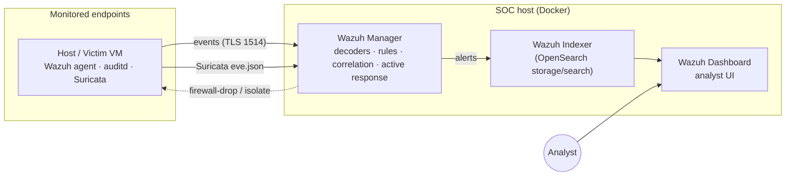

# 01 — Architecture

## What this lab is
A small but complete **Security Operations Centre**: log collection from
endpoints, a network IDS, a SIEM/XDR that correlates and alerts, custom
detection rules mapped to MITRE ATT&CK, incident-response playbooks, and
investigation write-ups. It is deliberately sized to run on an **8 GB laptop**.

## Data flow



## Components

| Layer | Tool | Role |
|-------|------|------|
| Endpoint agent | **Wazuh agent** | Ships logs, FIM, auditd, SCA, runs active response |
| Host telemetry | **auditd** | Kernel-level execve, identity/sudoers file access (keyed) |
| Network IDS | **Suricata** | Inspects traffic, writes EVE JSON alerts |
| SIEM/XDR | **Wazuh Manager** | Decodes, matches rules, correlates, fires responses |
| Storage/search | **Wazuh Indexer** | OpenSearch — stores and indexes alerts |
| Visualisation | **Wazuh Dashboard** | Where the analyst triages and hunts |

## Why single-node
The Wazuh manager, indexer and dashboard run as three containers on one host via
[`deploy/docker-compose.yml`](../deploy/docker-compose.yml). A single-node
deployment is the right call for a home lab: it's the full product (nothing is
stubbed), it upgrades cleanly, and it fits the RAM budget below. Scaling out to a
multi-node indexer cluster is a config change, not a redesign.

## RAM budget (8 GB host)

| Piece | Approx. RAM |
|-------|-------------|
| Wazuh indexer (512m heap + overhead) | ~1.3 GB |
| Wazuh manager | ~0.8 GB |
| Wazuh dashboard | ~0.6 GB |
| One victim VM (boot only for attacks) | ~2 GB |
| Host OS + browser | remainder |

The victim VM is only powered on while you actively run a simulation — that's the
trick that keeps the whole thing inside 8 GB. See
[`02-setup.md`](02-setup.md).

## Repository map
```
deploy/         the SOC stack (compose, configs, Suricata, auditd)
scripts/        bootstrap, rule deployment, health, endpoint installers
detections/     Wazuh rules + decoders, Sigma rules, the detection catalogue
playbooks/      incident-response playbooks (SANS/NIST lifecycle)
simulations/    safe scripts that trigger each detection
investigations/ full analyst write-ups
docs/           you are here
```
