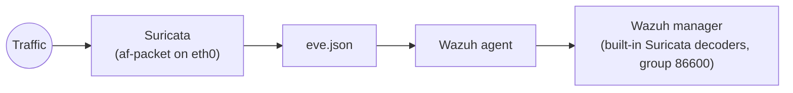

# 04 — Network IDS (Suricata)

Suricata is the lab's network sensor. It inspects packets on an endpoint's
interface and writes structured alerts to `/var/log/suricata/eve.json`, which the
Wazuh agent forwards — so network detections land in the same dashboard as host
detections.

## Placement
Run Suricata **on the endpoint whose traffic you want to see** — the victim VM
and/or the SOC host. In a home lab without a mirror/SPAN port, host-based
placement is the pragmatic choice: each host watches its own traffic.



## Install & rules
Install and configure with one script, then load the custom rules:
```bash
sudo bash scripts/install-suricata.sh          # detects interface, enables EVE + Community ID
# then load deploy/suricata/custom.rules — see:
```
Full steps and the rule list are in
[`../deploy/suricata/README.md`](../deploy/suricata/README.md). The six custom
signatures (SIDs 1000001–1000006) cover recon, EICAR delivery, SQLi, scanner
user-agents and a reverse-shell heuristic — each MITRE-tagged.

## Key settings the installer sets
- **Interface** via `/etc/default/suricata` (`IFACE`, `af-packet` mode).
- **Community ID** on — a hash of the 5-tuple that lets you pivot between a
  Suricata alert and other logs describing the *same flow*.
- **Ruleset** from the free **Emerging Threats Open** feed via `suricata-update`,
  plus this repo's `custom.rules`.

## Verify
```bash
curl -s http://testmynids.org/uid/index.html >/dev/null   # benign NIDS test
sudo tail -f /var/log/suricata/eve.json | grep '"event_type":"alert"'
# Dashboard: rule.groups:suricata
```
`HOME_NET` defaults to RFC1918 ranges, which is correct for a home lab; adjust in
`/etc/suricata/suricata.yaml` if your topology differs.
