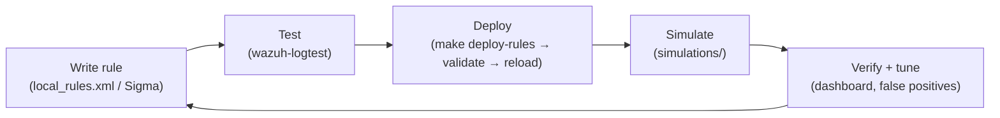

# 05 — Detection engineering

How detections are built, tested, deployed and tuned in this lab. The goal is a
small **detection-as-code** loop that mirrors how a real team ships rules.

## The loop


Everything lives in git, so a change is reviewable and reversible, and
`scripts/deploy-rules.sh` **validates the ruleset before restarting the manager** —
a broken rule never takes production down.

## Principles
1. **Map to MITRE ATT&CK.** Every rule names a technique. It forces you to know
   *what* you're detecting and lets you reason about coverage
   ([09](09-mitre-attack-coverage.md)).
2. **Prefer behaviour and correlation over signatures.** "Success *after* brute
   force" (100002) and "payload staged *and* netcat executed" (INV-03) are far
   higher-signal than any single noisy event.
3. **Reserve ID space.** Wazuh `100000+`, Suricata `1000000+` — no collisions with
   vendor rulesets.
4. **If you can't simulate it, you can't trust it.** Each rule has a matching
   script in [`simulations/`](../simulations/README.md).

## Rule levels → alerting
| Level | Meaning | Example |
|------:|---------|---------|
| 0–4 | Informational / logged | 100070 (demo app event) |
| 5–9 | Notable | 100062 (file in /tmp) |
| 10–11 | High | 100001 (brute force), 100050 (web attack) |
| 12+ | Critical | 100002, 100031, 100060 |

The manager stores everything ≥ level 3 (`log_alert_level` in
[`wazuh_manager.conf`](../deploy/config/wazuh_cluster/wazuh_manager.conf)).

## Writing a rule (the parts that matter)
```xml
<rule id="100031" level="12">
  <if_group>audit</if_group>                 <!-- narrow to the right source -->
  <field name="audit.key">priv_esc</field>   <!-- match a decoded field       -->
  <description>Sudoers configuration modified ...</description>
  <mitre><id>T1548.003</id></mitre>          <!-- ATT&CK mapping              -->
</rule>
```
Correlation adds `<if_matched_sid>`, `<same_source_ip/>`, `<frequency>` and
`<timeframe>` (see 100001/100002/100072).

## Custom decoders
When a log source is bespoke, you write a decoder first — see the `homesoc-app`
example in
[`detections/wazuh-rules/local_decoder.xml`](../detections/wazuh-rules/local_decoder.xml),
which extracts `user` and `srcip` so the rules can correlate a brute force.

## Testing before shipping
```bash
make logtest      # paste a sample log line, see which decoder + rule match
```
No need to launch a real attack to know a rule is syntactically and logically
right. Only after logtest passes do you `make deploy-rules` and then `simulate`.

## Tuning false positives
When a rule is noisy, **don't delete it — constrain it**: add a `<field>` filter,
allow-list a known-good source, or require correlation. Record what you changed
and why in the relevant investigation write-up — that record *is* the evidence of
detection-engineering judgement that reviewers look for.

## Portable detections (Sigma)
Each Wazuh rule has a [Sigma](../detections/sigma/README.md) twin so the logic
isn't locked to one product and can be converted to Elastic, Splunk, Sentinel,
etc. with `sigma convert`.
